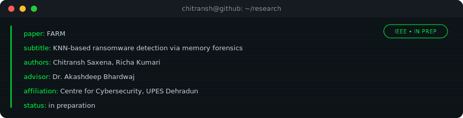
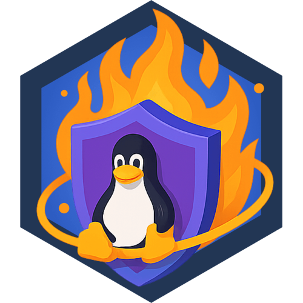
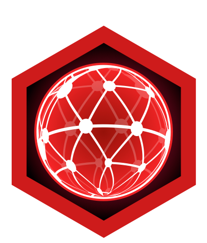
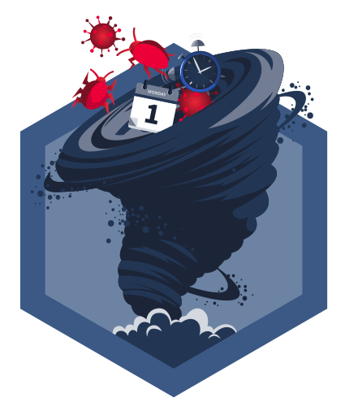
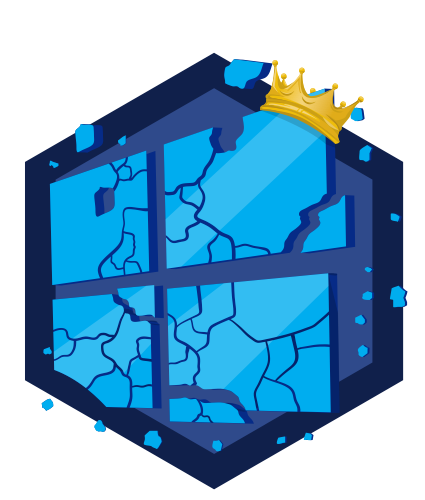
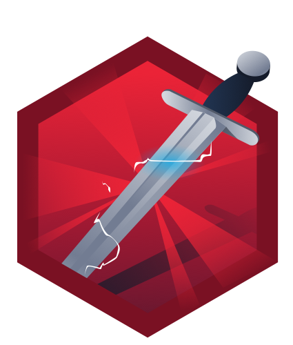
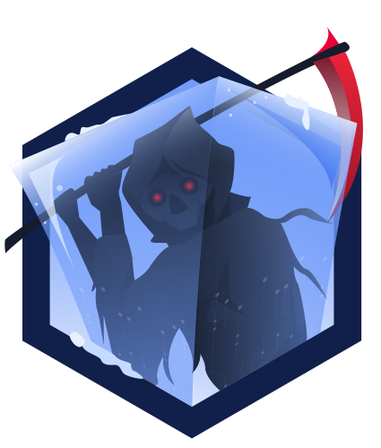
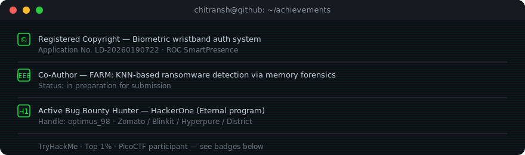

  

I'm a final-year B.Tech (Hons.) Computer Science student specializing in Cybersecurity at UPES
Dehradun, working across AppSec, AI/LLM security, and memory forensics — currently splitting time
between manual bug bounty work, ML-based ransomware detection research, and prep for security
engineering roles.

### 🚀 About Me

- 🎓 **Pursuing:** B.Tech (Hons.) in Computer Science, specializing in **Cybersecurity** at [UPES Dehradun](https://www.upes.ac.in/)
- 🛡️ **Focus:** Application security, AI/LLM security evaluation, and memory forensics
- 🌱 **Currently:** Co-authoring **FARM** — an IEEE paper on KNN-based ransomware detection via memory forensics
- 💼 **Working on:** Manual bug bounty hunting on HackerOne's **Eternal** program (Zomato / Blinkit / Hyperpure / District)
- 📜 **Registered Copyright:** Biometric wristband authentication system (App No. LD-20260190722)

### 🛠️ Tech Stack

| | |
|---|---|
| **Languages** |       |
| **Security & Forensics** |     |
| **Web & Backend** |      |
| **Data & Research** |     |
| **Cloud & Tooling** |    |

### 🏆 Highlights

#### Projects

- **[SentriAI — AI SOC Platform](https://github.com/CHITRANSH1705/SentriAI-AI-Security-Evaluation-Threat-Intelligence-Platform)** — full-stack dashboard for evaluating and monitoring LLM security posture in real time, with findings mapped to MITRE ATLAS. React 19 + TypeScript frontend, Express backend.
- **[ChainCrypt](https://github.com/CHITRANSH1705/ChainCrypt)** — secure file storage tool: password-based encryption, file chunking, and a lightweight JSON blockchain ledger for tamper-evident integrity checks, with email notification on decrypt.
- **[0-Crack Forensic Tool](https://github.com/CHITRANSH1705/0-Crack-Forensic-tool)** — portable Python-based digital evidence collector covering system/process, network, USB/storage, and system-behavior forensics for incident response.
- **[RAM Sentinel](https://github.com/CHITRANSH1705/RAM-Sentinel)** — Linux RAM-monitoring daemon with configurable alert thresholds, top-memory-consumer capture at trigger time, and a proper systemd service (shellcheck-clean).
- **[Cloud Security Governance Platform](https://github.com/CHITRANSH1705/Cloud-Security-Governance-Platform)** — glassmorphic multi-cloud security posture management UI (dashboard, findings, compliance center for NIST/CIS/ISO, policy manager). *UI/concept build with a recorded demo — not yet wired to a live backend.*

#### Research

#### Tools I Use

- **BugHunter** — AI-assisted recon-to-report bug bounty CLI, originally built by [shuvonsec](https://github.com/shuvonsec/claude-bug-bounty). I run a configured instance for HackerOne engagements.

#### CTF & Practice

**TryHackMe** — Top 1% · [full profile](https://tryhackme.com/p/chitranshsaxena)

### 🎖️ Achievements

### 📈 GitHub Stats

### 🐍 Contribution Graph

<picture>
  <source media="(prefers-color-scheme: dark)" srcset="https://raw.githubusercontent.com/CHITRANSH1705/CHITRANSH1705/output/github-contribution-grid-snake-dark.svg" />
  <source media="(prefers-color-scheme: light)" srcset="https://raw.githubusercontent.com/CHITRANSH1705/CHITRANSH1705/output/github-contribution-grid-snake.svg" />
  
</picture>

<!-- Renders once .github/workflows/snake.yml has run and created the "output" branch. -->

